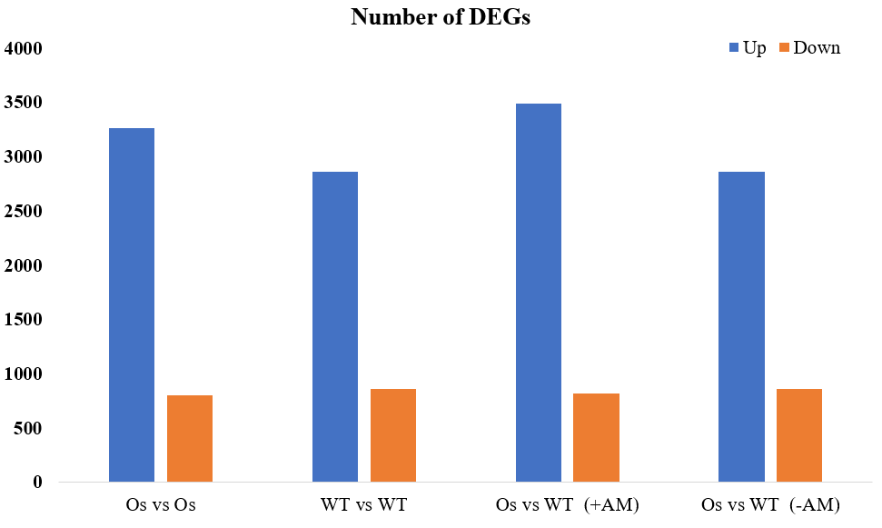
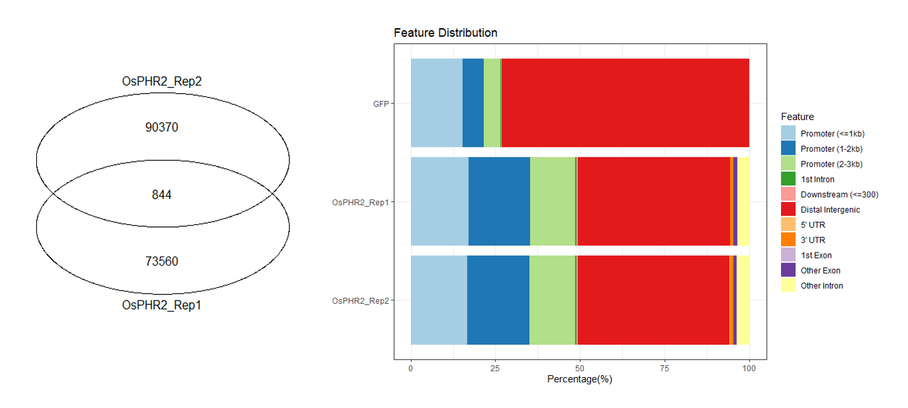
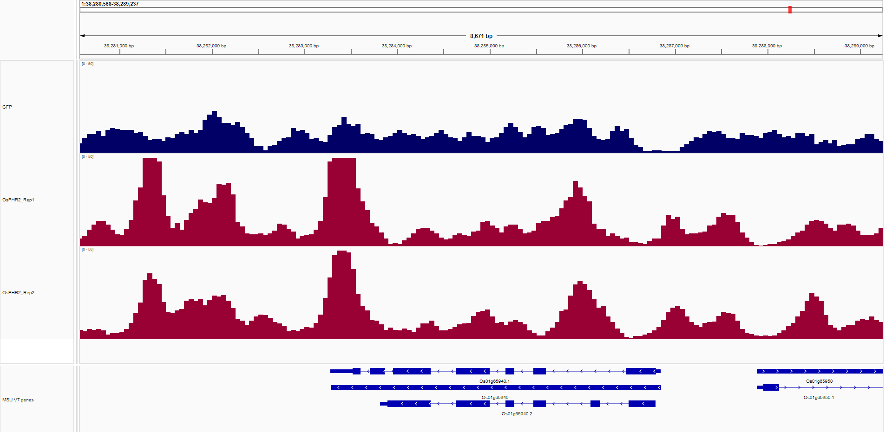
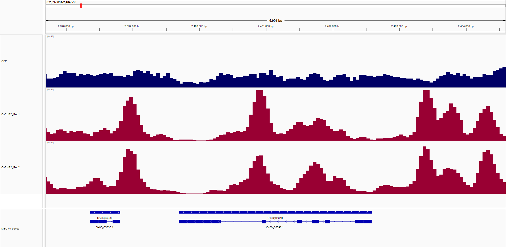
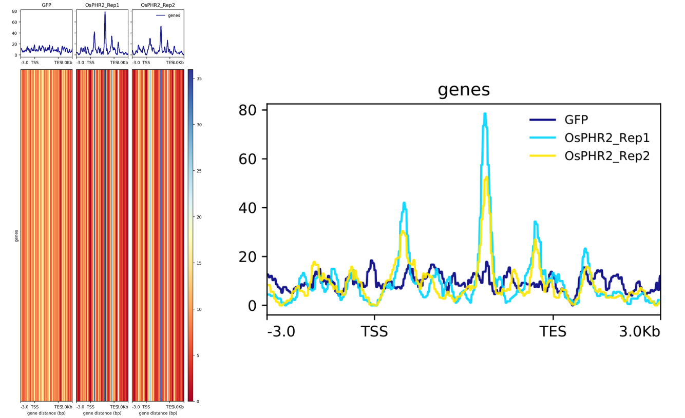
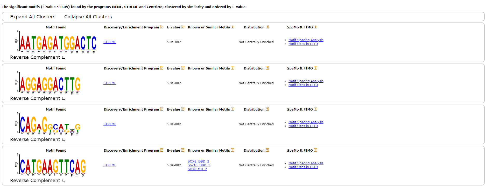

## 文章信息

文章题为"A phosphate starvation response-regulated receptor-like kinase, OsADK1, is required for mycorrhizal symbiosis and phosphate starvation responses"。该文章发表于 New Phytologist（中科院一区，IF=9.3，第一作者：Jincai Shi，通讯作者：Ertao Wang）。

此处对该文章的 RNA-seq 与 DAP-seq 数据分析部分进行复现，所得出的数据文件均在此目录。

！！！注意：复现的 RNA-seq 分析中差异基因的数量以及 DAP-seq 实验中样品 peaks 的一致性与原文结果不同。

> 在与原文作者沟通后，发现这种差异可能是由于分析方法和过滤参数设置的不同（包括所使用的分析软件不同）造成的。原文可能应用了更为严格的筛选标准。不同的分析方法和筛选标准导致基因数量的差异是常见的现象。尽管如此，复现的结果仍然支持原文中的讨论。
> 
> 下面是原文作者提供的部分参数
>
> **转录组分析参数**
> 
> - clean trimmomatic-0.32 末端 4 碱基平均质量大于 20
> - mapping bowtie2 2.2.1，参考序列为 uniq-cds，参数默认，单端 mapping；统计 reads 数 samtools 0.1.19，参数默认
> - 差异基因使用 R 包 DEGseq，差异基因的标准是 | log2（fold change）| > 1，rpkm > 20，p < 0.001，q < 0.001
>
> **DAP-seq 分析参数**
>
> - 使用 fastp（version 0.20.1，默认参数）软件对目标蛋白（TF）样本和阴性对照（Halo）样本的原始数据进行质控，包括去除接头、重复序列和低质量序列，得到 clean data
> - 之后利用 bowtie2（version 2.4.2，--end-to-end --sensitive）将 Clean Reads 与指定的参考基因组进行序列比对，得到 bam 格式的比对文件
> - 将唯一比对上的结果去重后，使用 MACS2（version 2.2.7.1，-f BAMPE --keep-dup auto -q 0.05）进行 Peak Calling，获得的 bigwig 格式文件可使用 IGV 软件进行可视化展示
> - 使用 R 包 ChIPseeker 对 peak 进行注释，使用 HOMER（v4.11.1）进行 motif 分析

## RNA-seq

RNA-seq 数据在国家基因数据库：[CNP0003633](https://db.cngb.org/search/project/CNP0003633/)

```bash
wget -c -nH -np -r -R "index.html*" --cut-dirs 4 ftp://ftp.cngb.org/pub/CNSA/data5/CNP0003633/CNS0625460/
wget -c -nH -np -r -R "index.html*" --cut-dirs 4 ftp://ftp.cngb.org/pub/CNSA/data5/CNP0003633/CNS0625461/
wget -c -nH -np -r -R "index.html*" --cut-dirs 4 ftp://ftp.cngb.org/pub/CNSA/data5/CNP0003633/CNS0625462/
wget -c -nH -np -r -R "index.html*" --cut-dirs 4 ftp://ftp.cngb.org/pub/CNSA/data5/CNP0003633/CNS0625463/
wget -c -nH -np -r -R "index.html*" --cut-dirs 4 ftp://ftp.cngb.org/pub/CNSA/data5/CNP0003633/CNS0625464/
wget -c -nH -np -r -R "index.html*" --cut-dirs 4 ftp://ftp.cngb.org/pub/CNSA/data5/CNP0003633/CNS0625465/
wget -c -nH -np -r -R "index.html*" --cut-dirs 4 ftp://ftp.cngb.org/pub/CNSA/data5/CNP0003633/CNS0625466/
wget -c -nH -np -r -R "index.html*" --cut-dirs 4 ftp://ftp.cngb.org/pub/CNSA/data5/CNP0003633/CNS0625467/
wget -c -nH -np -r -R "index.html*" --cut-dirs 4 ftp://ftp.cngb.org/pub/CNSA/data5/CNP0003633/CNS0625468/
wget -c -nH -np -r -R "index.html*" --cut-dirs 4 ftp://ftp.cngb.org/pub/CNSA/data5/CNP0003633/CNS0625469/
wget -c -nH -np -r -R "index.html*" --cut-dirs 4 ftp://ftp.cngb.org/pub/CNSA/data5/CNP0003633/CNS0625470/
wget -c -nH -np -r -R "index.html*" --cut-dirs 4 ftp://ftp.cngb.org/pub/CNSA/data5/CNP0003633/CNS0625471/
```

下载的是 fastq.gz 文件，无需解压就可使用，将所有的文件放在 fastqgz 文件夹。

原文中描述`The cleaned reads were mapped against the O. sativa ssp. Japonica cv Nipponbare reference genome (http://rice.plantbiology.msu.edu).`并未提到使用什么软件进行比对，所以使用常用的 hisat2 来将 reads 回帖到参考基因组，使用 [RGAP](http://rice.uga.edu/) 数据库的基因组来建立 hisat2 索引，但是实际过程中，使用 RGAP 的基因组进行比对后，featureCounts 无法从 exon 进行计数，所以改用 [Ensembl Plants](https://plants.ensembl.org/index.html) 的基因组：

```bash
hisat2-build -p 4 Oryza_sativa.IRGSP-1.0.dna.toplevel.fa Oryza_sativa
```

先建立 files_list.txt 文件，将文件前缀写入，方便于后面对文件进行批处理：

```txt
Osphr123_-AM1
Osphr123_AM1
Osphr123_-AM2
Osphr123_AM2 
Osphr123_-AM3
Osphr123_AM3
Wildtype_-AM1
Wildtype_AM1
Wildtype_-AM2
Wildtype_AM2
Wildtype_-AM3
Wildtype_AM3
```

将测序数据回帖到参考基因组：

```bash
cat ./files_list.txt | while read id;
do
    hisat2 \
    -x ./Oryza_sativa/Oryza_sativa \
    -p 5 \
    -1 ./fastqgz/${id}_1.fastq.gz \
    -2 ./fastqgz/${id}_2.fastq.gz \
    -S ./compared/${id}.sam
done
```

- -p 指定使用的线程数
- -x 指定参考基因组的索引文件的路径
- -1 指定测序数据的第一个配对端的文件路径
- -2 指定测序数据的第二个配对端的文件路径
- -S 指定输出比对结果的文件路径

完成后便得到了 sam 文件，接着需要将 sam 文件排序压缩为 bam 文件：

```bash
cat ./files_list.txt | while read id ;do
    samtools \
    sort \
    -n -@ 5 \
    ./compared/${id}.sam \
    -o ./sorted/${id}.bam
done
```

文中同样未提到使用的定量软件，于是使用常用的 featureCounts：

```bash
nohup featureCounts \
-T 5 \
-t exon \
-g Name \
-a Oryza_sativa.IRGSP-1.0.58.chr.gff3 \
-o counts \
-p Osphr123_-AM1.bam Osphr123_AM1.bam Osphr123_-AM2.bam Osphr123_AM2.bam Osphr123_-AM3.bam Osphr123_AM3.bam Wildtype_-AM1.bam Wildtype_AM1.bam Wildtype_-AM2.bam Wildtype_AM2.bam Wildtype_-AM3.bam Wildtype_AM3.bam &
```

- -T 指定使用的线程数
- -t 指定要计数的特征类型
- -g 指定用于分组的基因标识符
- -a 指定参考基因组的注释文件
- -o 指定输出特征计数的文件名
- -p 指定要计数的 BAM 文件

得到 counts 矩阵后，默认为转录本水平的表达矩阵，进行后续分析需要使用基因水平的表达矩阵，使用 TBtools 的 Trans Value Sum 工具将不同的转录本进行合并，随后进行 fpkm 标准化：

```r
rm(list = ls())

counts <- read.csv(
    'counts',
    header = TRUE,
    sep = '\t',
    # row.names = "Geneid",
    comment.char = '#',
    check.names = FALSE
)

# 对第 6 列以后的数据进行 fpkm 计算
for (clm in colnames(counts)[6:ncol(counts)]) {
    col_fpkm <- paste0(clm, "_FPKM")     # 新列的名称，加上"_FPKM"后缀
    total <- sum(counts[, clm])          # 计算每个样本的总读数
    counts[col_fpkm] <- (counts[, clm] * 10^6) / (counts[, "Length"] / 1000)  # 使用相应样本的长度值计算 FPKM 并添加 FPKM 列
}

# 删掉原有的 counts
counts = counts[,-c(2:19)]

numeric_mask <- sapply(counts, is.numeric)
counts[numeric_mask] <- lapply(counts[numeric_mask], function(x) ifelse(x < 1, x + 1, x))

write.table(counts, file = 'fpkm_output', sep = '\t', row.names = FALSE)
```

得到标准化的矩阵后，进行差异表达分析，原文`The differentially expressed genes (DEGs) were identified using the R package DEGseq v.1.20.0 in different comparisons with P-value < 0.001 and |Fold change| > 2.`提到使用 DEGseq 包进行，但是 DESeq2 包相对于 DEGseq 包功能更加强大、更精确和稳健，所以此处使用 DESeq2 包进行差异表达分析：

```r
rm(list = ls())  
Sys.setenv(LANGUAGE = "en")

library(DESeq2)

fpkm = read.csv(
    'fpkm_merge', 
    header = T,  
    sep = '\t', 
    row.names = "Geneid", 
    comment.char = '#', 
    check.name = F
)

# 将小数四舍五入为整数
fpkm <- round(fpkm)

# 将空值全部写为 1
numeric_mask <- sapply(fpkm, is.numeric)
fpkm[numeric_mask] <- lapply(fpkm[numeric_mask], function(x) ifelse(is.numeric(x) & x < 1, x + 100, x))

# 保留行相加大于 10 的数据
fpkm <- fpkm[rowSums(fpkm)>10, ]

# 保证所有小数都转化为整数
fpkm[-1, ] <- apply(fpkm[-1, ], 2, as.integer)

# 如果有缺失值，删除这些行/列
missing_values <- sum(is.na(fpkm))
if (missing_values > 0) {
  fpkm <- na.omit(fpkm)
}

samples = data.frame(
    sampleID = c("Osphr123_-AM1", "Osphr123_-AM2", "Osphr123_-AM3", "Osphr123_AM1", "Osphr123_AM2", "Osphr123_AM3", "Wildtype_-AM1", "Wildtype_-AM2", "Wildtype_-AM3", "Wildtype_AM1", "Wildtype_AM2", "Wildtype_AM3"), 
    sample = c("Osphr123_reduce_AM", "Osphr123_reduce_AM", "Osphr123_reduce_AM", "Osphr123_add_AM", "Osphr123_add_AM", "Osphr123_add_AM", "Wildtype_reduce_AM", "Wildtype_reduce_AM", "Wildtype_reduce_AM", "Wildtype_add_AM", "Wildtype_add_AM", "Wildtype_add_AM")
)

rownames(samples) = samples$sampleID
samples$sample = factor(samples$sample, levels = c('Osphr123_reduce_AM', 'Osphr123_add_AM', 'Wildtype_reduce_AM', 'Wildtype_add_AM'))
dds = DESeqDataSetFromMatrix(countData = fpkm, colData = samples, design = ~sample)
dds_count <- DESeq(dds, fitType = 'mean', minReplicatesForReplace = 7, parallel = FALSE)

Osphr123_reduce_AM_vs_Osphr123_add_AM <- results(dds_count, contrast = c('sample', 'Osphr123_reduce_AM', 'Osphr123_add_AM'))
Wildtype_reduce_AM_vs_Wildtype_add_AM <- results(dds_count, contrast = c('sample', 'Wildtype_reduce_AM', 'Wildtype_add_AM'))
Wildtype_add_AM_vs_Osphr123_add_AM <- results(dds_count, contrast = c('sample', 'Wildtype_add_AM', 'Osphr123_add_AM'))
Wildtype_reduce_AM_vs_Osphr123_reduce_AM <- results(dds_count, contrast = c('sample', 'Wildtype_reduce_AM', 'Osphr123_reduce_AM'))

result1 <- data.frame(Osphr123_reduce_AM_vs_Osphr123_add_AM, stringsAsFactors = FALSE, check.names = FALSE)
result2 <- data.frame(Wildtype_reduce_AM_vs_Wildtype_add_AM, stringsAsFactors = FALSE, check.names = FALSE)
result1 <- data.frame(Wildtype_add_AM_vs_Osphr123_add_AM, stringsAsFactors = FALSE, check.names = FALSE)
result2 <- data.frame(Wildtype_reduce_AM_vs_Osphr123_reduce_AM, stringsAsFactors = FALSE, check.names = FALSE)

write.table(result1, 'Osphr123_reduce_AM_vs_Osphr123_add_AM.DESeq2.txt', col.names = NA, sep = '\t', quote = FALSE)
write.table(result2, 'Wildtype_reduce_AM_vs_Wildtype_add_AM.DESeq2.txt', col.names = NA, sep = '\t', quote = FALSE)
write.table(result1, 'Wildtype_add_AM_vs_Osphr123_add_AM.DESeq2.txt', col.names = NA, sep = '\t', quote = FALSE)
write.table(result2, 'Wildtype_reduce_AM_vs_Osphr123_reduce_AM.DESeq2.txt', col.names = NA, sep = '\t', quote = FALSE)
```

根据阈值对数据进行筛选：

| | Up | Down |
| - | - | - |
| Os vs Os | 3266 | 803 |
| WT vs WT | 2865 | 858 |
| Os vs WT  (+AM) | 3489 | 816 |
| Os vs WT  (-AM) |	2865 | 858 |



## DAP-seq

DAP-seq 数据在国家基因数据库：[CNP0003634](https://db.cngb.org/search/project/CNP0003634/)

```bash
wget -c -nH -np -r -R "index.html*" --cut-dirs 4 ftp://ftp.cngb.org/pub/CNSA/data5/CNP0003634/CNS0625472/
wget -c -nH -np -r -R "index.html*" --cut-dirs 4 ftp://ftp.cngb.org/pub/CNSA/data5/CNP0003634/CNS0625473/
wget -c -nH -np -r -R "index.html*" --cut-dirs 4 ftp://ftp.cngb.org/pub/CNSA/data5/CNP0003634/CNS0625474/
```

下载的是 fastq.gz 文件，无需解压就可使用，将所有的文件放在 fastqgz 文件夹。

根据原文`the cleaned DAP-seq reads were mapped to the Nipponbare reference genome (https://rice.plantbiology.msu.edu/) using Bowtie2`使用 [RGAP](http://rice.uga.edu/) 数据库的基因组来建立 bowtie2 索引，但是实际过程中，使用 RGAP 的基因组进行比对后，无法使用 samtools 建立索引，所以改用 [Ensembl Plants](https://plants.ensembl.org/index.html) 的基因组：

```bash
bowtie2-build Oryza_sativa.IRGSP-1.0.dna.toplevel.fa Oryza_sativa
```

先建立 files_list.txt 文件，将文件前缀写入，方便于后面对文件进行批处理：

```txt
GFP
OsPHR2_Rep1
OsPHR2_Rep2
```

将测序数据回帖到参考基因组：

```bash
mkdir compared
cat ./files_list.txt | while read id;
do
    bowtie2 \
    -p 10 -x Oryza_sativa/Oryza_sativa \
    -1 ./fastqgz/${id}_1.fastq.gz \
    -2 ./fastqgz/${id}_2.fastq.gz \
    -S ./compared/${id}.sam
done
```

- -p 指定使用的线程数
- -x 指定参考基因组的索引文件的路径
- -1 指定测序数据的第一个配对端的文件路径
- -2 指定测序数据的第二个配对端的文件路径
- -S 指定输出比对结果的文件路径

完成后便得到了 sam 文件，接着需要将 sam 文件排序压缩为 bam 文件并为 bam 文件建立索引，以便进行进行后续的分析：

```bash
mkdir sorted
cat ./files_list.txt | while read id;
do
    samtools sort ./compared/${id}.sam -o ./sorted/${id}.bam
    samtools index ./sorted/${id}.bam
done
```

根据原文`Peak calling was performed using the MACS2 with Q-value ≤ 0.05.`使用 macs2 进行 calling peaks：

```bash
mkdir peaks
cat ./files_list.txt | while read id;
do
    macs2 callpeak -t ./sorted/${id}.bam -f BAM -g 3.6e+8 -n ./peaks/${id} --qvalue 0.05
done
```

- -f 指定输入文件格式
- -g 指定基因组的大小
- --qvalue 指定 qvalue 的值

对 peaks 进行注释与可视化，由于原文并未提到使用的软件，所以使用常见的 ChIPseeker 包来进行，并且绘制韦恩图：

```r
rm(list = ls())  
library("GenomicFeatures")
library("ChIPseeker")
spombe <- makeTxDbFromGFF("./peaks/all.gff3")

gfp <- readPeakFile('./peaks/GFP.bed')
Rep1 <- readPeakFile('./peaks/OsPHR2_Rep1.bed')
Rep2 <- readPeakFile('./peaks/OsPHR2_Rep2.bed')

peaks <- list(GFP=gfp, OsPHR2_Rep1=Rep1, OsPHR2_Rep2=Rep2)
OsPHR2_peaks <- list(OsPHR2_Rep1=Rep1, OsPHR2_Rep2=Rep2)

peakAnno <- lapply(peaks, annotatePeak, tssRegion = c(-3000, 3000), TxDb = spombe)

plotAnnoBar(peakAnno)

vennplot(OsPHR2_peaks)
```

得到结果：



根据原文`The coverage was generated by DeepTools, normalizing to RPM (Reads per million mapped reads) and then used for IGV view.The regions of the peaks were defined based on the annotations of the reference genome`使用 deeptools 生成 bigWig 文件，由于现在的 deeptools 没有 RPM 这个标准化的格式，所以设置为 FPKM：

```bash
mkdir bigwig
cat ./files_list.txt | while read id;
do
    bamCoverage -b ./sorted/${id}.bam -o ./bigwig/${id}.bw --normalizeUsing RPKM
done
```

将 bigWig 文件导入到 IGV 进行查看：




随后就要计算样本的信号丰度，这里需要一个 bed 文件，deeptools 文档说明可以从 [UCSC](http://genome.ucsc.edu/cgi-bin/hgTables?command=start) 下载 bed 文件，但是 UCSC 数据库没有水稻的数据，因此根据 UCSC 上 [BED format](http://genome.ucsc.edu/FAQ/FAQformat.html#format1) 的说明手动建立，从基因组注释文件中整理以下信息并保存为`OsPHR2.bed`文件：

```txt
chr7    14753753        14759288        OsPHR2  cds     +
```

然后使用 computeMatrix 计算信号丰度：

```bash
cd bigwig
nohup computeMatrix \
scale-regions \
-p 10 \
-R OsPHR2.bed \
-S GFP.bw OsPHR2_Rep1.bw OsPHR2_Rep2.bw \
-b 3000 \
-a 3000 \
--regionBodyLength 5000 \
--skipZeros \
-o tss-tts.gz &
```

- scale-regions 将测量数据进行缩放以适应指定的区域进行计算
- -p 指定计算矩阵时使用的线程数
- -R 指定参考区域的 BED 文件
- -S 指定用于计算的信号文件
- -b 指定在参考区域的上游区域的长度
- -a 指定在参考区域的下游区域的长度
- -o 指定输出文件
- --regionBodyLength 指定在参考区域的区域主体长度
- --skipZeros 在计算矩阵时跳过值为零的区域

使用 plotProfile 和 plotHeatmap 进行可视化，plotProfile 将所有 bigWig 文件的结果绘制在同一个图中，而 plotHeatmap 将 bigWig 文件的结果分开绘制，并且绘制热图：

```bash
plotProfile --dpi 720 -m tss-tts.gz -out tss-tts.pdf --plotFileFormat pdf --perGroup
plotHeatmap -m tss-tts.gz -out tss-tts.png
```


最后使用 [MEME-Chip](https://meme-suite.org/meme/tools/meme-chip) 工具来鉴定 OsPHR2 的 motif，使用 DNA 序列进行鉴定。

