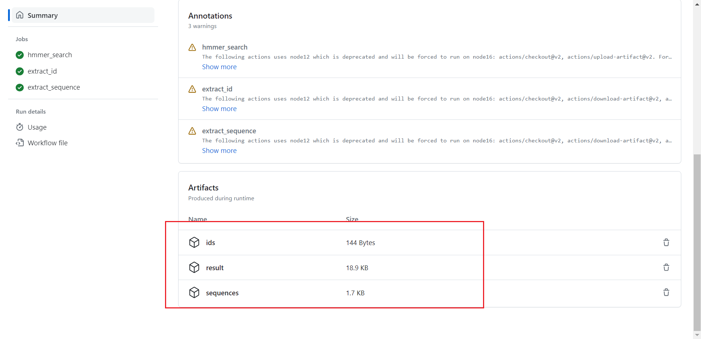
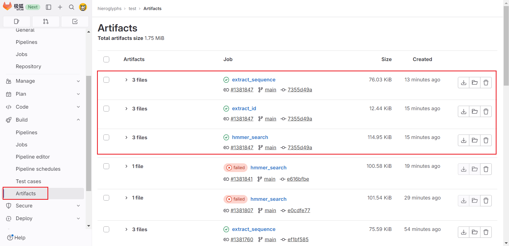

# Description

This study utilized GitLab CI/CD and GitHub Actions to automate the construction of the Hidden Markov Model ( HMM ) and conduct a search for Homeotic genes. It further screened out gene IDs that satisfy the user-defined threshold and extracted protein sequences from the obtained results files.

# Usage

You need to define the following variables in `input.py`.

| name | example | description |
| -- | -- | -- |
| PF_number | PF00031 | The Gene family number of the [pfam](http://pfam-legacy.xfam.org/) , such as PF00031 |
| evaluation_threshold | 1e-5 | The threshold for filtering IDs from the results of hmmsearch |
| species | Oryza_sativa | Species of gene family |

# Results

You can download the completed files from the GitHub Action or Gitlab CI/CD running artifacts.

Usually contains the following three artifacts:

> result.out ( Results of hmmsearch )

> id_list.txt ( Filtered ID List )

> protein_for_target_id.fasta ( Protein sequence extracted from ID list )

# Problem

Different transcripts of the same gene were not removed.
